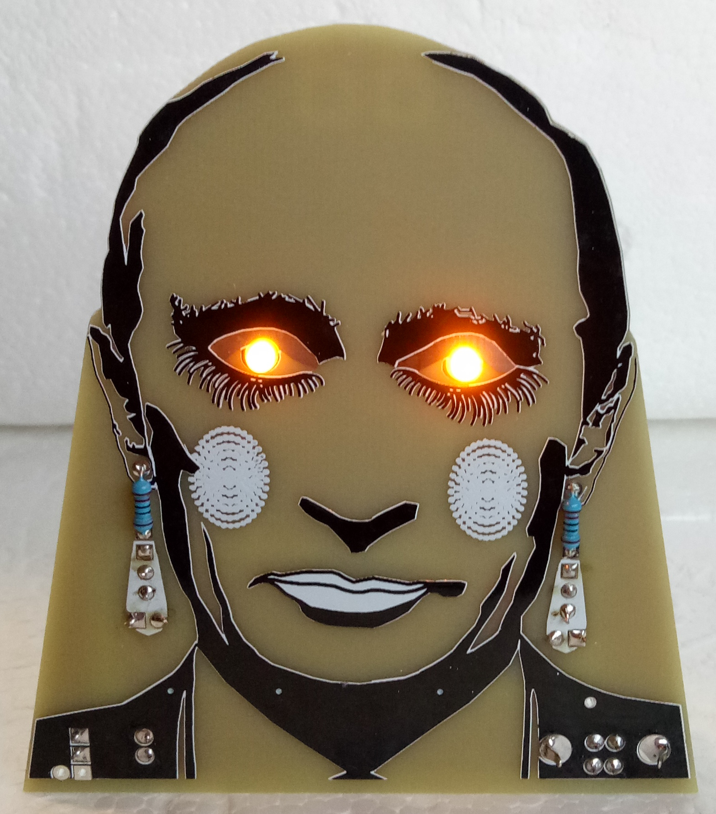

# STEM4ukraine-Clown-Blinky-Analog

A simple PCB with a pair of glowing LEDs!

A fun school STEM project demonstrating simple through hole coldering and analogue electronics using USB power to drive the two LEDs.

Celebrate the glorious leader of the russian federation as you learn about electronics!

An ideal project for russian schools unable to source the microcontrollers used in other STEM projects due to international sanctions 
and/or the lack of stolen washing machines.

A badge version and multivibrator version are in development. 

The front of the PCB:

