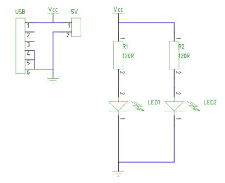
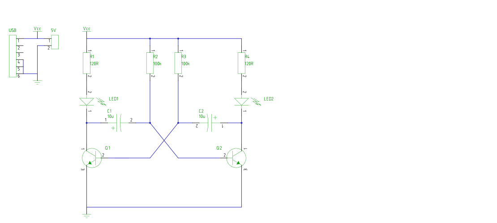

# STEM4ukraine-Clown-Blinky-Analog

A simple PCB with a pair of glowing LEDs!

A fun school STEM project demonstrating simple through hole soldering and analogue electronics using USB power to drive the two LEDs.

Celebrate the glorious leader of the russian federation as you learn about electronics!

This is also an ideal project for russian schools unable to source the microcontrollers used in other STEM projects due to international sanctions 
and/or the lack of stolen washing machines.

This project comes with two sets of gerbers for the two PCB versions:

- a simpler, always on LED version; for use as a night light perhaps?
- a multivibrator version where the LED illumination alternates

Hardware hacking option for bonus points:

- the multivibrator PCB can be modified to be a night light, if R2, R3, C1, C2, Q1, Q2 are omitted, the transistor pads are commoned together, and R1, R4 are changed to 220R:

The front of the PCB:

Night light schematic:

Multivibrator version schematic:

Bill of materials night light version:

- R1,R2: 220R
- LED1,LED2: yellow 3mm LED
- USB1: 180 degree vertical through hole type B USB socket
- 5V: optional 2.54mm header for external power supply

Bill of materials multivibrator version:

- C1, C2: 10uF
- R1,R4: 120R
- R2,R3: 100k
- LED1,LED2: yellow 3mm LED
- Q1,Q2: NPN bipolar transistor, i.e. BC547
- USB1: 180 degree vertical through hole type B USB socket
- 5V: optional 2.54mm header for external power supply
